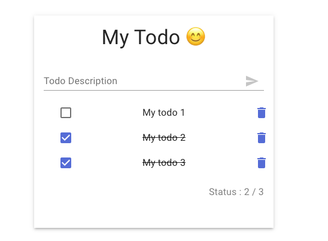
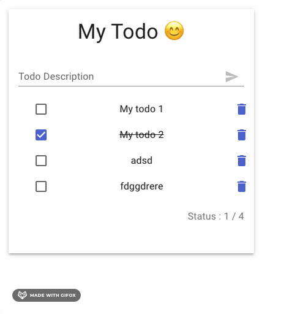
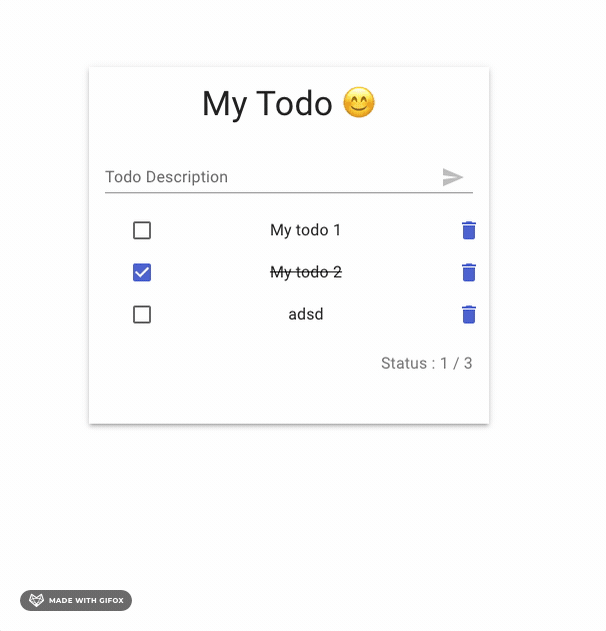

# Todo APp

Basic app in react 
it's crud for todolist

### SCRIPT
### `npm start` => for start app
### `npm test` => for launch test app
### `npm run build` => for launch build app

#### Screens

